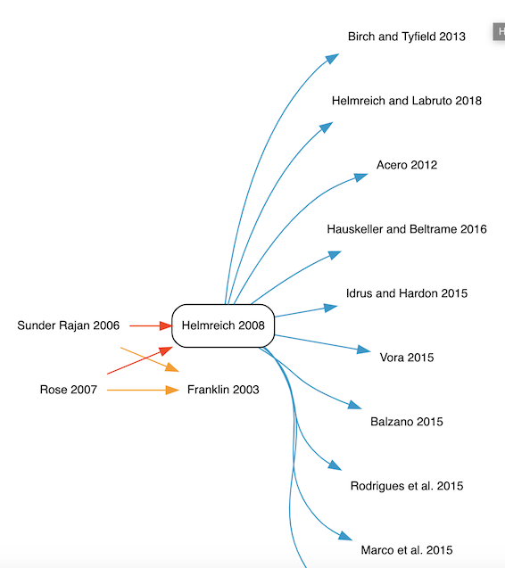

# Relata Prototype: Design Doc

## Summary

The [Relata] prototype will be a web-based tool through which users may explore and add relations between scholarly works. Its functionality is intended to "privilege values of epistemological pluralism and critique" via a graph of these relations, in contrast to conventional search tools premised on explicit citation and scores based on similarity or popularity.

This design document [describes] the prototype application and establishes [development milestones]. While intended to outline a clear scope within which development may proceed, this is a living document and may be updated as the project team sees fit.

Though there is an expectation that future iterations of the Relata application might be deployed for a range of other literatures, a [Google survey] distributed among scholars of cultural anthropology constitutes the initial dataset of works and relations to be explored in the prototype.

The prototype may be built and deployed locally over the course of development. It is expected that a partner institution will be found for long-term hosting. Code and related assets may be shared via the [relata] organization on GitHub.

A light proof-of-concept has already been developed using [Meteor] and [d3-graphviz], and will serve to orient development of the full prototype. The full prototype, in turn, will offer a basis for future work that does not fall within the scope defined here.

[describes]: #app-description
[development milestones]: #development-milestones
[Relata]: https://culanth.org/engagements/relata
[Google survey]: https://docs.google.com/forms/d/e/1FAIpQLSfothf_5SoQj2KRUFt0bdEVJS7eqkY70DwFt6CDJeJsBZdThA/viewform
[relata]: https://github.com/relata
[Meteor]: https://www.meteor.com
[d3-graphviz]: https://github.com/magjac/d3-graphviz

## App description

The Relata prototype app will comprise three layers: a _web-based graphic interface_ for visually exploring works and relations, an underlying _controller/API_ that drives the interface and queries data, and a _data store_ in which data for the works, relations, and users to be persisted across sessions is modeled and retained. Additionally, a _configuration file_ may be used to specify global settings for a given application instance, such as color scheme, hostname, credentials for external dependencies, etc.

The prototype app will refer to the [CrossRef API] for search purposes. API calls issued against CrossRef will respect its [etiquette guidelines]. The [Zotero API] may serve as an additional fallback by representing works not found in CrossRef.

See below for a more detailed description of each layer.

[CrossRef API]: https://github.com/CrossRef/rest-api-doc
[etiquette guidelines]: https://github.com/CrossRef/rest-api-doc#etiquette
[Zotero API]: https://www.programmableweb.com/api/zotero

### Web interface

The web interface will consist of a primary "explorer" view as well as secondary views in which a user may [add/edit relations] and [manage her account]. The web interface should include the following components:

[add/edit relations]: #add-edit-view
[manage her account]: #user-account-management-view

#### Navigation bar

Used to log in/out, access user account management view, and access related links. Persists across explorer view as well as secondary views.


#### Visualization pane

Contains an interactive network visualization for visually exploring a graph of relations. Nodes represent works; edges represent relations. Edges may be marked by color, pattern, weight, or label to reflect relation type.

Relations contributed by users should be markedly distinct from those contributed by authors (i.e., part of the source dataset).

Like the detail pane, this pane highlights one node (with its various relations) at a time as the primary selection. Clicking on another node brings it into focus as the new primary selection, and the detail pane updates to reflect this.

Reasonable bounds on scroll and zoom will help the user avoid being stranded in a blank or illegible pane.



#### Detail pane

Displays panels representing the currently selected node, its relations (edges), associated nodes, and annotations. Panels for the current node/work and related nodes/works display citations in Chicago format. Each panel is visually marked by color/pattern/weight/label to denote the relation it identifies.

As in the [visualization pane], relations contributed by users should be markedly distinct from those contributed by authors (i.e., part of the source dataset).


[visualization pane]: #visualization-pane

#### Search tool

The search tool queries works within the prototype app's data store (i.e., within the corpus), but also queries the CrossRef and/or Zotero APIs for works not currently included in the corpus. Search results appear in a dropdown menu. Selecting a given work allows the user to associate it with the currently selected work via a relation to be specified in an "add/edit" view modal.

If possible, search relevance should be boosted using any keywords associated with the currently selected work.

#### Add/edit view

The user enters the add/edit view when inserting a relation to a work via the search tool or selecting an existing relation that the user owns (has contributed) for editing. This view should display editable input fields corresponding to the properties of the Relation entity in the data model.

#### User account management view

In the account management view, a user can view and edit her credentials (email, password) and view a list of the relations she has defined. Selecting a relation from this list should launch the [add/edit view].

[add/edit view]: #add-edit-view

### Controller/API

The controller should support operations to create, read, update, and delete (as applicable) instances of the data entities defined below. It may be tightly integrated with the web view and data store (as in a web application framework like Meteor) or live separately as a REST service to which the web view points.

#### Algorithmic inference of relations between works: a placeholder

As a placeholder for future development, the prototype should include a simple inference function that surfaces relations among works by the same author (that is, authors whose names are deemed identical via a simple string match).

### Data store

A data model (schema) must be defined for the following entities:

#### Relation

Represents a relation type and (if applicable) annotation. Based on the fields defined in the source dataset.

Relation "sub-type" data from the source dataset should be folded into the annotation property.

For the prototype, a "work" (representing a bibliographic work, or node) sub-entity can be defined via properties of the relation entity. Entity resolution will be performed by way of a fuzzy match algorithm: if the algorithm produces a confidence level above a given threshold, two instances may be deemed the same work.

The work sub-entity should consist of the metadata fields sufficient to produce a Chicago-style citation, as well as unique identifiers (e.g., DOI) and any author- or API-supplied keywords to facilitate efficient recall of associated works.

Consider using Zotero's [CrossRef REST translator] to help model works from disparate sources (Relata dataset, CrossRef, Zotero).

[CrossRef REST translator]: https://github.com/zotero/translators/blob/master/Crossref-REST.js

#### Author

Represents a scholar who has contributed to the source dataset.

#### User

Represents a user who has set up an account within the Relata app. Used to support login and account management, as well as adding and editing custom relations.

### Configuration file

A configuration file should be used to specify global instance-level settings, such as color scheme, hostname, and credentials.

Color scheme settings for relation types may be as simple as mappings from relation type strings to HTML color names or codes, as in the following example:

```json
{
   "critique": "red",
   "criticism": "red",
   "critica": "red",
   "extension": "blue",
   "rejoinder": "blue",
   "absence": "yellow",
   "omission": "yellow"
   "*": "grey" /* default */
}
```

## Development milestones

### Phase 1: Design

* ~~Gather technical requirements~~
* ~~Examine proof-of-concept and source dataset~~
* ~~Compose design document~~
* **In progress:** Research platform(s) for mounting app
* **In progress:** Formally define data model for entities
* **In progress:** Clean source dataset
* Populate cleaned source dataset into data model
* Sketch out wireframes for views
* Define controller actions (API endpoints/verbs) sufficient to support app functionality
* Define platform(s) for mounting app

### Phase 2: Build core functionality for displaying works/relations from source dataset

* Build data store based on data model
* Build controller actions to support core functionality
* Build web interface to support core functionality

### Phase 3: Build user contribution functionality

* Build controller actions to support user add/edit and account management functionality
* Build web interface to support user add/edit and account management functionality

## Future work

The following points, though out of scope for the prototype, may be relevant for future development:

* Collect and display version history for relations, perhaps stored as an array within a given relation object
* Each instance of the Relata application connects to other instances via a shared graph
* Support user credentials that work across multiple Relata instances
* Support user auth via an external provider such as Zotero to avoid forcing users to maintain a Relata account
* Fully developed algorithmic inference of relations between works
